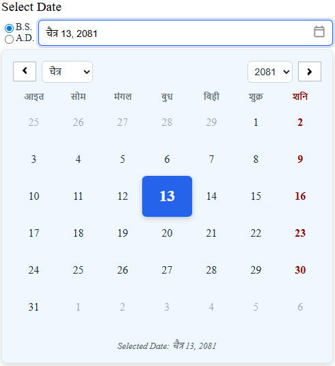

# Nepali Calendar (REACT) 🌞

   

A modern, responsive, and customizable **React calendar component** that supports both **Bikram Sambat (B.S.)** and **Gregorian (A.D.)** calendars, designed for seamless date selection in web applications. Built with 💙 by **Ganesh Bhatt**, a passionate React developer, this component is perfect for applications requiring Nepali date support alongside Gregorian dates, with a custom 365-day B.S. calendar for academic purposes (2070–2081 B.S.).

## 🚀 Features

- **Dual Calendar Support**: Switch between Bikram Sambat (B.S.) and Gregorian (A.D.) calendars, with B.S.-only mode when `dynamicDate` is `false`.
- **Custom B.S. Calendar**: Uses a 365-day structure for 1970–2099 B.S., tailored for academic use:
- **Responsive Design**: Supports configurable widths (`size` prop: 4, 6, or 12 columns) with a clean, modern UI.
- **Date Constraints**: Restrict dates using `minYears` (e.g., limit to past years) or `disableFuture` (specific date cutoff).
- **TypeScript Support**: Fully typed for robust development.
- **Customizable**: Props for `label`, `variant`, `selectTodayDate`, and `onChange` callback.
- **Accessible**: Read-only input field with click-to-open calendar and click-outside-to-close functionality.
- **Beautiful Styling**: Smooth animations, custom CSS, and a polished look with `aliceblue` background.

## 📸 Screenshot



## 🛠 Installation

1. **Clone the Repository**:
   ```bash
   git clone https://github.com/ganeshbhatt/nepali-sambat.git
   cd nepali-sambat
   npm i
   ```

## 📖 Usage


### Props

| Prop              | Type                            | Default     | Description                                                                |
|-------------------|---------------------------------|-------------|----------------------------------------------------------------------------|
| `label`           | `string`                        | `undefined` | Label for the input field.                                                 |
| `name`            | `string`                        | `"date"`    | Name attribute for the input field.                                        |
| `minYears`        | `string`                        | `undefined` | Restrict dates to a maximum age (e.g., `"100"` for 100 years ago).         |
| `disableFuture`   | `string`                        | `undefined` | Restrict dates to a specific date (e.g., `"2078-12-30"` for B.S.).         |
| `variant`         | `'outlined'|'standard'|'filled'`| `"normal"`  | Variant for the calendar (normal).                                         |
| `theme`           | `'light' | 'standard' | 'basic'`| `"light"`   | Theme for the calendar (normal).                                           |
| `selectTodayDate` | `boolean`                       | `false`     | Auto-select today’s date on initialization.                                |
| `size`            | `4 | 6 | 12`                    | `6`         | Width of the calendar (Bootstrap-like grid columns: 33%, 50%, or 100%).    |
| `onChange`        | `function`                      | `undefined` | Callback returning selected date in `{ ad: string, bs: string }` format.   |

### Output Format

The `onChange` callback returns an object like:
```json
{
  "target": { "name": "myDate" },
  "value": {
    "ad": "2025-07-04",
    "bs": "2082-03-20"
  }
}
```

## 🎨 Styling

The calendar uses a clean, modern design with:
- **Custom CSS**: Responsive grid system
- **Smooth Animations**: Fade-in effect for the calendar popup.
- **Customizable Themes**: Light (`aliceblue` background) or dark variants.
- **Responsive Layout**: Calendar width matches the input field, controlled by the `size` prop.

## 📅 Calendar Data

The B.S. calendar uses a custom 365-day structure for 2070–2081 B.S., defined in `pattern.ts`:
- **Months**: Baisakh, Jestha, Asar, Shrawan, Bhadra, Ashwin, Kartik, Mangsir, Poush, Magh, Falgun, Chaitra.
- **Years**: 1970–2099 B.S..
- **Note**: This is a custom academic calendar, standard B.S. calendar (365-366 days with lunar adjustments).

## 🛠 Development

### Dependencies
- `react`: ^16.2.0
- `typescript`: ^4.9.0

### Project Structure
```
nepali-calendar/
├── src/
│   ├── assets/
│   ├── components/
│   ├── constants/
│   ├── types/
│   ├── utils/
│   ├── validator/    ### for testing
│   ├── styles.css
├── package.json
├── README.md
```

### Build
```
npm run build
```

## 🤝 Contributing

Contributions are welcome! 🎉
1. Fork the repository.
2. Create a feature branch (`git checkout -b feature/awesome-feature`).
3. Commit your changes (`git commit -m 'Add awesome feature'`).
4. Push to the branch (`git push origin feature/awesome-feature`).
5. Open a Pull Request.

## 📜 License

This project is licensed under the Ganesh Bhatt - see the [LICENSE](LICENSE) file for details.

## 🙏 Acknowledgements

- **Ganesh Bhatt**: For designing and developing this component.
- **React Community**: For the amazing ecosystem and tools.

## 📬 Contact
| 👤 **Ganesh Bhatt**  
- GitHub: [github.com/Ganesh123AS](https://github.com/Ganesh123AS)  
- Email: ganeshbhatt818@gmail.com  
- LinkedIn: [linkedin.com/in/ganesh123as](https://linkedin.com/in/ganesh123as)  
|  |
---

🌟 **Star this repository** if you find it useful! Feel free to reach out with feedback or suggestions.
🌟 **UPDATES** Soon to be updated for other format supportable.